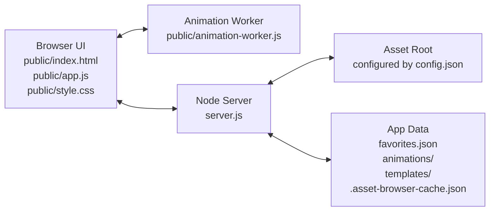
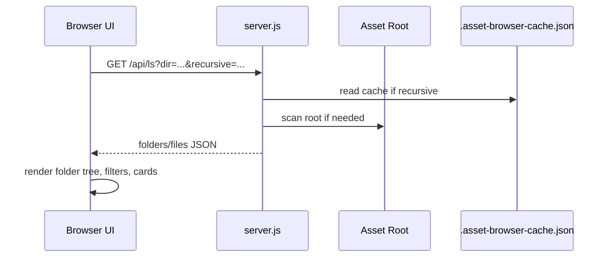
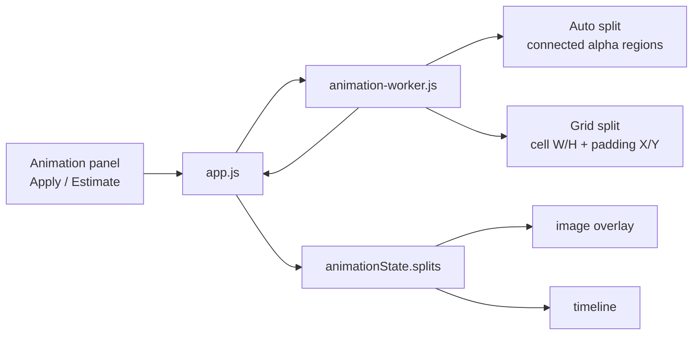

# Architecture Overview

This project is a local, zero-dependency asset browser. It is a vanilla Node.js server plus a vanilla HTML/CSS/JavaScript frontend. There is no build step, package manager, framework, or bundler.

## High-Level Shape



The browser owns almost all UI behavior and state. The server provides filesystem access, static files, asset scanning, favorites/config persistence, default animation persistence, template persistence, and native Windows folder selection.

## Repository Map

| Path | Role |
| --- | --- |
| `server.js` | Local HTTP server, filesystem APIs, static serving, asset indexing, favorites, animation/template storage. |
| `public/index.html` | Static UI shell. Most controls are hard-coded here and connected by IDs from `app.js`. |
| `public/app.js` | Main frontend application. Handles grid browsing, image viewer, animation editor, preview, save/load, and keyboard shortcuts. |
| `public/style.css` | All visual styling for the sidebar, grid, viewer, animation panel, timeline, and modals. |
| `public/animation-worker.js` | Web Worker for expensive sprite splitting so the UI thread stays responsive. |
| `tests/` | Playwright browser regression tests and the local test runner. |
| `config.json` | Stores the active asset root path. |
| `favorites.json` | Stores favorites by asset root. Ignored by git. |
| `.asset-browser-cache.json` | Recursive asset index cache. Ignored by git. |
| `animations/` | Generated per-image animation JSON files. Ignored by git. |
| `templates/` | Generated animation template JSON files. Ignored by git. |

## Runtime Entry Points

Start the app with:

```powershell
node server.js
```

Then open:

```text
http://localhost:3000
```

The server listens on port `3000` by default. Tests can set `PORT` to run an isolated server.

## Backend Architecture (`server.js`)

`server.js` uses only Node standard library modules:

| Module | Purpose |
| --- | --- |
| `http` | HTTP server. |
| `fs` | File scanning, reading, writing, streaming, watching. |
| `path` | Path normalization and containment checks. |
| `crypto` | Hashes for animation/template filenames and source image identity. |
| `child_process.exec` | Windows folder picker and opening files in Explorer. |

### Backend State

| Variable | Purpose |
| --- | --- |
| `ASSETS_DIR` | Current asset root, loaded from `config.json`. |
| `assetIndexDirty` | Whether cached recursive index may be stale. |
| `assetWatcher` | `fs.watch` watcher on the asset root. |
| `assetIndexSnapshot` | In-memory copy of cache metadata used to ignore access-only watch events. |

### Backend Data Folders

The app owns two runtime folders under the repo root:

| Folder | Contents | Git |
| --- | --- | --- |
| `animations/` | Default saved animation data per source image. | Ignored |
| `templates/` | Reusable animation templates. | Ignored |

The server creates these folders lazily through `ensureAppDataDirs()`.

### Core Backend Helpers

| Helper Group | Important Functions | Purpose |
| --- | --- | --- |
| Asset typing/filtering | `getFileType`, `isIgnoredAssetName`, `shouldSkipAssetEntry` | Decide what files to show and what to ignore. |
| Asset scanning/cache | `scanAssets`, `buildAssetCache`, `readAssetCache`, `filterIndex` | Build and filter recursive file indexes. |
| Asset watching | `startAssetWatcher`, `handleAssetWatchEvent`, `isAccessOnlyWatchChange` | Mark cache dirty when the asset tree changes. |
| Favorites | `readFavoritesStore`, `loadFavoritesForRoot`, `saveFavoritesForRoot`, `moveFavoritesForRootChange` | Persist favorites per asset root. |
| App data | `animationFileForPath`, `templateFileForName`, `getSourceIdentity`, `findCompatibleAnimation` | Store/load animation and template JSON with source matching. |
| Streaming | `streamFile`, `assertFileReadable` | Serve static assets and HTTP range audio safely. |

### Backend Routes

| Method | Route | Purpose |
| --- | --- | --- |
| `GET` | `/` and static files | Serve `public/index.html`, frontend files, and assets. |
| `GET` | `/api/ls` | List asset folders/files, optionally recursive and cache-backed. |
| `GET` | `/api/index-status` | Return recursive index cache state. |
| `GET` | `/api/favorites` | Load favorites for current root. |
| `GET` | `/api/config` | Return current config/root path. |
| `GET` | `/api/choose-folder` | Open Windows folder picker via PowerShell. |
| `GET` | `/api/animation-default` | Load compatible default animation JSON for an image. |
| `GET` | `/api/templates` | List saved templates. |
| `GET` | `/api/template` | Load one template by name. |
| `POST` | `/api/config` | Change asset root and persist `config.json`. |
| `POST` | `/api/open-folder` | Open/select an asset in Windows Explorer. |
| `POST` | `/api/rename` | Rename an asset and update favorites. |
| `POST` | `/api/favorite` | Add/remove favorites. |
| `POST` | `/api/animation-default` | Save default animation JSON for an image. |
| `POST` | `/api/template` | Save an animation template. |

### Image Identity for Saved Animations

Default animation files include source identity:

- relative asset path
- file name
- file size
- modified time
- image width/height from the browser
- SHA-256 content hash

Loading is hybrid:

1. Basic match first: same path/name/size/mtime/dimensions.
2. If basic match fails but the image looks related, hash fallback is used.

This keeps normal loads fast while still allowing moved/renamed identical files to match.

## Frontend Architecture (`public/index.html`, `public/app.js`, `public/style.css`)

The frontend is one large script organized by feature blocks. DOM elements are addressed by stable IDs from `index.html`.

### Frontend State

Most state lives in globals in `public/app.js`.

| State Area | Main Variables |
| --- | --- |
| Directory/grid | `currentDir`, `currentItems`, `currentPage`, `currentFilter`, `currentExtFilters` |
| User settings | `ITEMS_PER_PAGE`, `isRecursive`, `maxDepth`, `thumbSize`, `canvasBg`, `viewerLayout`, `viewerGapX/Y` |
| Selection | `selectedPaths`, `lastSelectedPath` |
| Image viewer | `imgImages`, `imgCurrIndex`, `rangeStart`, `rangeEnd`, `workspaceHistory` |
| Pan/zoom/tools | `imgScale`, `imgTx`, `imgTy`, `activeTool`, measuring variables |
| Animation editor | `animationState` object |

Most user settings persist in `localStorage`.

### Main UI Areas

| UI Area | HTML Anchor | Primary Code |
| --- | --- | --- |
| Sidebar/settings | `#sidebar` | settings bindings, folder tree, favorites |
| Grid view | `#grid-view`, `#grid` | directory listing, filtering, cards, pagination |
| Text view | `#text-view` | inline text display |
| Image view | `#image-view` | multi-image workspace, pan/zoom, measure/select tools |
| Animation panel | `#animation-panel` | split, timeline, preview, import/export/templates |

## Asset Browsing Flow



The grid renders cards for folders, images, audio, text, and unknown files. Filters are recomputed from current files. Images can be opened singly, selected in bulk, or opened through `Open All`.

## Image Viewer Flow

Opening an image calls `initImageWorkspace(item)`:

1. Switches from grid/text view to image view.
2. Builds the current image list from filtered files.
3. Clears animation workspace.
4. Adds the selected image to `#workspace-canvas`.
5. Resets pan/zoom.
6. When the image loads, applies layout, centers the workspace, and tries auto-loading saved animation data.

Image viewer controls include:

- previous/next image
- add previous/add next image to workspace
- reset to single default image
- pan and zoom
- measurement line
- rectangular copy selection
- rulers
- open containing folder in Windows Explorer
- animation panel toggle

Keyboard shortcuts are handled near the end of `app.js`. Shortcuts are active in the image viewer and ignored only when focus is in a typing field.

## Animation System

The animation editor uses `animationState`.

Important fields:

| Field | Purpose |
| --- | --- |
| `splits` | `Map<imagePath, splitData>`; detected/cropped frame rectangles per image. |
| `animations` | Ordered animation tracks. Each track references frame IDs. |
| `activeAnimationId` | Currently selected track. |
| `selectedFrameIds` | Source frame selection from image overlay/timeline. |
| `selectedTimelineIndexes` | Selected timeline frame indexes for edit operations. |
| `timelineZoom` | Visual zoom only. Does not change frame timing. |
| `previewPlaying` / `previewLooping` | Preview playback state. |
| `imageCache` | Cached `Image` objects used by preview drawing. |
| `autoSaveTimer` | Debounced save timer for default animation persistence. |

### Split Pipeline



`applyAnimationSplit()` reads:

- split target: focused image or all shown images
- mode: auto or grid
- cell width/height
- padding X/Y

It calls `splitImageInWorker()` for each target image. The worker returns frame rectangles, and `app.js` normalizes them into frame IDs like:

```text
image/path.png::12
```

### Auto Split vs Grid Split

Auto split:

- Finds connected opaque pixel regions.
- Ignores fully transparent areas.
- Produces tight bounding boxes.

Grid split:

- Produces even rectangular cells.
- Uses fixed cell width/height.
- Can skip gaps with padding X/Y.
- Does not inspect transparency.

Estimate split:

- Runs auto split in the background.
- Filters tiny artifacts.
- Clusters significant auto frames into rows/columns.
- Updates grid fields only.
- Does not replace current split until the user clicks Apply.

### Timeline Model

The current timeline is rule-driven:

- Animation frames are an ordered list.
- Timing is derived from FPS and frame count.
- Frame start positions are equidistant and begin at `0s`.
- Frame thumbnails align their left edge to the frame start time; they are not centered over the tick.
- Duration is `frame count / FPS`, so 2 frames at 2fps = 1s, 2 frames at 1fps = 2s, and 2 frames at 4fps = 0.5s.
- Timeline zoom is visual only. It does not change FPS, duration, preview speed, or exported timing.
- Zoom starts from the fitted side-panel width. A 2x zoom doubles the timeline content width and enables horizontal scrolling when needed.
- The timeline grows to prevent frame thumbnail overlap. The current minimum is one 58px chip width per frame.
- When the side panel grows and the current timeline fits inside it, the rendered zoom auto-fits to the wider panel without persisting that fit as a user preference.

The timeline stores no user-edited timing slots. Functions such as `normalizeAnimationFrameSlots()` and `getTimelineFrameStartTime()` derive positions on demand.

### Timeline Editing

Supported operations:

- select
- multi-select with Ctrl/Cmd
- range select with Shift
- remove
- cut/copy/paste
- drag reorder
- insert point selection

After edits, the active animation is normalized and the timeline re-renders.

### Preview Playback

`drawAnimationPreview()` runs forever via `requestAnimationFrame`. Playback state changes do not stop the render loop; this avoids the preview dying after a while.

The preview:

- chooses current frame from elapsed time and derived timeline duration
- draws the frame crop to a canvas
- keeps a separate image cache
- updates the green timeline playhead from the same slot used to choose the preview frame
- supports loop on/off

## Animation Save/Load

There are two save/load modes.

### Default Auto-Save

Default per-image animation data is saved automatically to `animations/`.

Triggered by real animation edits:

- split apply
- frame select/add/remove/reorder
- timeline insert/remove/cut/paste
- animation rename
- FPS change
- new/delete animation
- import/template apply

Not triggered by:

- preview play/pause
- preview cursor movement
- timeline zoom
- selection-only UI interactions where no track changes

Saving is debounced by `scheduleDefaultAnimationSave()`.

### Export/Import

Export downloads a JSON file from the browser.

Import reads a user-selected JSON file and merges into the active image:

- creates animations with new names
- prompts on name conflicts
- supports yes/no/yes all/no all through prompt input
- overwrites default stored animation after successful import

### Templates

Templates live in `templates/`.

Saving a template stores:

- source identity
- split settings
- frame bounds
- animation names
- FPS
- frame order

Applying a template:

1. User picks a template by name.
2. Current image dimensions must match template dimensions.
3. If current split/animations would be replaced, user confirms.
4. Template creates animations for the current image using the same frame layout.
5. Result is saved as the current image default animation.

## Styling Architecture (`public/style.css`)

The stylesheet is organized mostly by UI area:

| Section | What It Styles |
| --- | --- |
| root/body | theme tokens and page layout |
| sidebar | folder tree, settings, favorites |
| grid | asset cards, filters, pagination, empty states |
| image toolbar/viewer | image workspace controls and tooltip |
| animation panel | split controls, track list, timeline, preview |
| modal | rename modal |

Important animation timeline classes:

- `.animation-timebar`
- `.animation-timebar-content`
- `.animation-timebar-marker`
- `.animation-timebar-cursor`
- `.animation-timeline`
- `.animation-frame-strip-content`
- `.animation-frame-chip`
- `.animation-frame-playhead`

The timebar and frame strip scroll together; the frame strip owns the visible horizontal scrollbar.

## Test Architecture

The app core still has no production dependencies or build step. Browser regression tests live under `tests/` and use Playwright when it is available locally or through the Codex bundled Node modules.

See `Docs/Testing.md` for the full onboarding, runbook, and handoff checklist.

Run the suite with:

```powershell
$env:NODE_PATH='C:\Users\rafan\.cache\codex-runtimes\codex-primary-runtime\dependencies\node\node_modules'
& 'C:\Users\rafan\.cache\codex-runtimes\codex-primary-runtime\dependencies\node\bin\node.exe' tests\run-playwright.js
```

The runner:

- starts `server.js` on `http://localhost:3130` by default
- uses `ASSET_BROWSER_TEST_URL` when provided
- fails on page errors, browser console errors, and failed requests
- saves failure screenshots to `test-results/`

`public/app.js` exposes a small `window.__ASSET_BROWSER_TEST__` seam for deterministic browser tests. It currently supports animation timeline setup and readback so tests can assert timeline geometry without depending on real asset files.

## Worker Architecture (`public/animation-worker.js`)

The worker receives:

```js
{ id, mode, bitmap, cellWidth, cellHeight, paddingX, paddingY }
```

It returns:

```js
{ id, frames, width, height }
```

Frame objects contain:

```js
{ x, y, w, h, row, col, index }
```

The worker has two algorithms:

- `splitGrid()`: fixed grid with optional padding.
- `splitAuto()`: connected-component scan over alpha pixels.

## Data Persistence Summary

| Data | Location | Owner |
| --- | --- | --- |
| UI preferences | `localStorage` | browser |
| Asset root | `config.json` | server |
| Favorites | `favorites.json` | server |
| Recursive asset cache | `.asset-browser-cache.json` | server |
| Watch diagnostics | `.asset-browser-watch.log` | server |
| Default animations | `animations/*.json` | server |
| Templates | `templates/*.json` | server |

Generated user data files are intentionally ignored by git.

## Common Change Points

| Task | Start Here |
| --- | --- |
| Add a backend endpoint | `server.js`, inside the `http.createServer` route block. |
| Add a UI control | `public/index.html`, then bind it near the relevant event bindings in `public/app.js`. |
| Add persistent UI setting | top of `public/app.js` plus `localStorage` reads/writes. |
| Change asset filtering | `matchesCurrentFilter()`, `getFilteredFiles()`, `renderDynamicFilters()`. |
| Change image workspace layout | `applyViewerLayout()`, `applyMosaicLayout()`, `centerVisibleWorkspace()`. |
| Change split behavior | `applyAnimationSplit()` and `public/animation-worker.js`. |
| Change estimate split | `estimateAnimationSplit()`, `estimateSplitForImage()`, `filterEstimateFrames()`. |
| Change timeline timing/layout | `getTimelineDurationForFrameCount()`, `getTimelineFrameStartTime()`, `getTimelineContentWidth()`, `normalizeTimelineZoomForWidth()`, `getPreviewFrameIndexAtTime()`. |
| Change preview drawing | `drawAnimationPreview()`, `getFrameImage()`, `getFrameSourceRect()`. |
| Change auto-save/load | `exportAnimationState()`, `importAnimationState()`, `scheduleDefaultAnimationSave()`, server animation routes. |
| Add browser tests | `tests/e2e/*.spec.js` and `tests/run-playwright.js`. |

## Current Architectural Tradeoffs

- `public/app.js` is large and feature-dense. It works as a no-build single-file app, but feature areas are tightly coupled through globals.
- UI controls depend on stable DOM IDs. Renaming IDs requires checking `app.js`.
- Browser prompts are used for import/template conflict decisions. This is simple but not polished.
- The animation system assumes one split layout per image at a time.
- The preview render loop intentionally never stops; playback state changes only affect which frame is drawn.
- The browser test seam is intentionally narrow and should stay focused on stable user-observable behavior.
- Recursive indexing uses a cache and watcher, but filesystem edge cases can still mark the cache dirty.

## Suggested Future Refactors

If this project grows, the safest refactor path is to split `public/app.js` by feature without changing behavior:

1. `state.js`: shared settings/state helpers.
2. `api.js`: fetch wrappers.
3. `grid.js`: directory/grid/favorites/filtering.
4. `viewer.js`: image workspace/pan/zoom/tools.
5. `animation.js`: animation state, split, timeline, preview, save/load.
6. `main.js`: bootstrapping and event binding.

Do this only after tests or a strong manual regression checklist exist, because current behavior depends on shared globals and event order.
